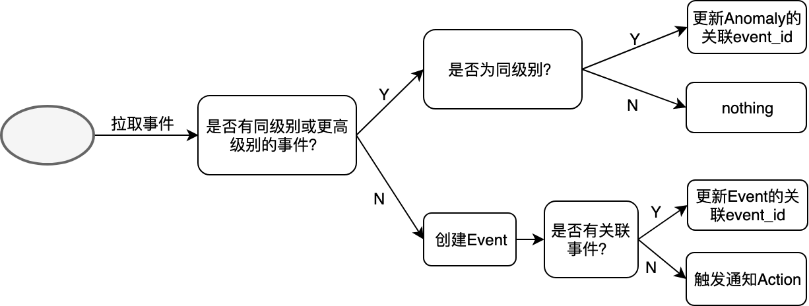

# Event

模块负责对事件做关联分析


## 模块设计

Event Process 流程



## 数据处理流程

进程从redis中获取到事件
- 首先判断是否有同级别或更高级别的事件正在产生
    - 是，则看级别是否为同级别
        - 是，只更新AnomalyRecords表的event_id
        - 否，do nothing
    - 否，则创建Event，并判断是否有关联的事件正在产生
        - 是，则只更新Event的关联p_event_id，状态变更为已收敛
        - 否，则触发通知的Action动作

## 相关数据说明

### 标准输入数据

```json
{
    "data":{
        "record_id":"{dimensions_md5}.{timestamp}",
        "value":1.38,
        "values":{
            "timestamp":1569246480,
            "load5":1.38
        },
        "dimensions":{
            "ip":"127.0.0.1"
        },
        "time":1569246480
    },
    "anomaly": {
        "1":{
            "anomaly_message": "",
            "anomaly_id": "{dimensions_md5}.{timestamp}.{strategy_id}.{item_id}.{level}",
            "anomaly_time": "2019-10-10 10:10:00"
        }
    },
    "strategy_snapshot_key": "xxx",
    "trigger": {
        "level": "1",
        "anomaly_ids": [
            "{dimensions_md5}.{timestamp}.{strategy_id}.{item_id}.{level}"
        ]
    }
}
```

### 标准输出数据

无

### redis 数据结构

记录事件ID的redis结构设计

待补充

## 监控指标

- 模块需统计指标数据，能代表目前的处理能力

## 日志记录

- 完善的日志记录

### 正常流水

正常日志截图

### 异常流水，错误排查，常见问题

常见错误，以及修复方案


## 单元测试


- 单元测试

## 性能数据

test